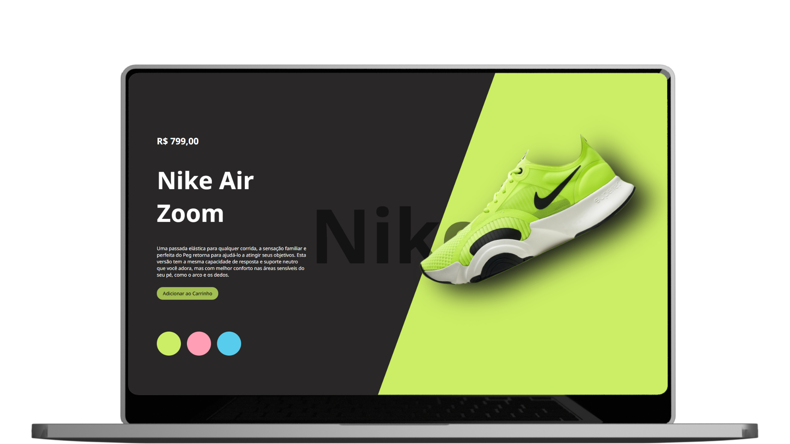

<h1>Nike</h1>
<h2>📋 Sobre o projeto: </h2>

Projeto desenvolvido utilizando HTML, CSS e JS. Dinamismo visual e o ponto forte do site. 👀

<h2> 📌Ferramentas Utilizadas no Projeto:</h2>
 

   
    
   
 

 <h2>🎥 Imagem e vídeo:</h2>
  
 <video width="320" height="240" controls>
  <source src="./videos/Vídeo de Apresentação.mp4" type="video/mp4">
</video>